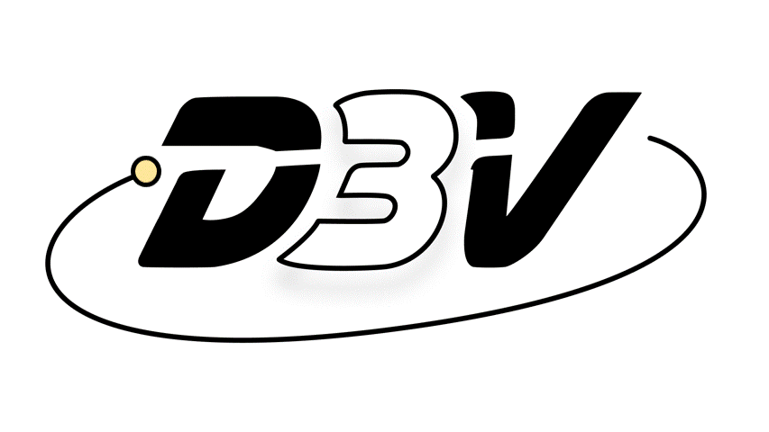
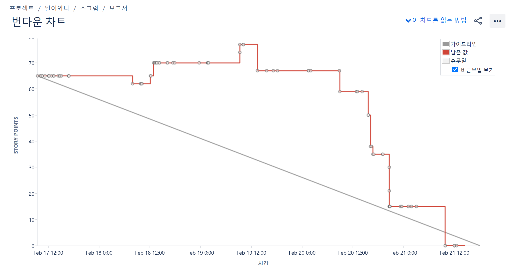
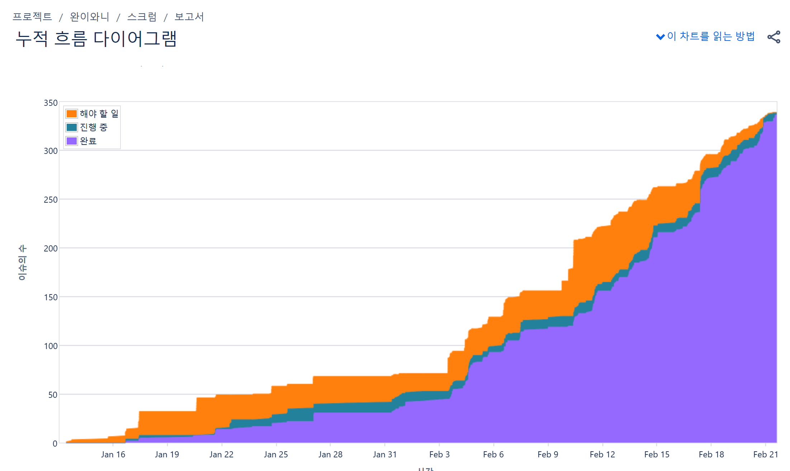

# 프로젝트 소개



## 하루 3개 질문으로 완성하는  맞춤형 IT 면접 준비 서비스

> **SSAFY 공통 프로젝트**의 일환으로 진행되는 본 프로젝트는 취업 준비생 혹은 개발 학습자를 대상으로,  
> **학습 질문 & 답변 관리**, **답변 AI 피드백**,**커뮤니티** 등의 기능을 제공하는 서비스입니다.  
> 사용자가 매일 주어진 질문에 답변하면서 학습 성과를 기록하고, 커뮤니티를 통해 소통하며,  
> AI를 활용한 답변 피드백을 받으며 보다 효율적인 면접 준비를 지원합니다.

<br/>

- [프로젝트 소개](#프로젝트-소개)
  - [하루 3개 질문으로 완성하는  맞춤형 IT 면접 준비 서비스](#하루-3개-질문으로-완성하는--맞춤형-it-면접-준비-서비스)
  - [주요 기능](#주요-기능)
    - [📚 데일리 3문제 시스템](#-데일리-3문제-시스템)
    - [🎤 답변 연구소](#-답변-연구소)
    - [🤖 AI 피드백 시스템](#-ai-피드백-시스템)
    - [📚 Knowledge Hub](#-knowledge-hub)
    - [👥 커뮤니티](#-커뮤니티)
  - [BACKEND 기술적 고민과 해결 과정](#backend-기술적-고민과-해결-과정)
    - [🔄 CI/CD 환경에서의 기술적 도전과 해결 방법](#-cicd-환경에서의-기술적-도전과-해결-방법)
      - [1. 사내 네트워크의 IP 제한 문제 해결](#1-사내-네트워크의-ip-제한-문제-해결)
      - [2. 단일 레포지토리 내 프론트엔드 및 백엔드 빌드 전략](#2-단일-레포지토리-내-프론트엔드-및-백엔드-빌드-전략)
      - [3. CORS Preflight 요청(OPTIONS)으로 인한 에러 발생](#3-cors-preflight-요청options으로-인한-에러-발생)
    - [⚙️ REDIS 캐싱 도입으로 성능 최적화](#️-redis-캐싱-도입으로-성능-최적화)
  - [FRONTEND 프론트엔드 아키텍처 설계](#frontend-프론트엔드-아키텍처-설계)
    - [🖥️ TypeScript 기반 개발](#️-typescript-기반-개발)
    - [🛠️ Redux 상태 관리](#️-redux-상태-관리)
    - [🗂️ 모듈화 아키텍처](#️-모듈화-아키텍처)
    - [👪 협업 워크플로우](#-협업-워크플로우)
  - [팀원 소개](#팀원-소개)
  - [팀 회고](#팀-회고)
    - [번다운 차트](#번다운-차트)
    - [누적 흐름 다이어그램](#누적-흐름-다이어그램)
    - [팀 한 줄 소감](#팀-한-줄-소감)

<br/>


<br>
<br/>

## 주요 기능

### 📚 데일리 3문제 시스템
1. **맞춤형 문제 큐레이션** ✨
   - 매일 3개의 직무 면접 맞춤 질문을 제공해드립니다
   - `개인별 학습 이력`과 `관심 직무`를 기반으로 문제를 추천해드립니다
   - `7일 주기`의 `복습 알고리즘`으로 효율적인 학습을 도와드립니다

2. **스마트 학습 관리** 📊
   - 미해결 문제(모르겠음을 체크한 문제)를 자동으로 관리하고 다시 출제해드립니다
   - 중요한 문제는 `북마크`로 저장하여 스터디 자료로 활용하실 수 있습니다
   - ⚡️ STREAK 시스템으로 학습 성과를 한눈에 확인하실 수 있습니다

### 🎤 답변 연구소
1. **실전 면접 시뮬레이션** 
   - 🎯 STT 기능으로 음성 답변을 텍스트로 변환해드립니다
   - ⏱️ 타이머 기능으로 실전 면접을 연습하실 수 있습니다
   - 🔒 답변 공개 범위를 자유롭게 설정하실 수 있습니다

### 🤖 AI 피드백 시스템
1. **24/7 AI 코칭 서비스**
   - 📝 AI가 답변의 `강점`과 `개선점`을 분석해드립니다
   - ✅ 맞춤형 모범 답안을 제시해드립니다
   - ⚡️ 실시간으로 피드백을 받아보실 수 있습니다

2. **커뮤니티 피드백** 👥
   - 다른 사용자들과 답변을 공유하고 피드백을 주고받으실 수 있습니다
   - 다양한 관점에서 학습하실 수 있습니다

### 📚 Knowledge Hub
1. **통합 질문 데이터베이스** 
   - 💼 다양한 직무별 전문 면접 질문을 제공해드립니다
   - 📊 실시간 인기 질문과 출제 빈도를 확인하실 수 있습니다
   - 🔄 최신 트렌드를 반영한 콘텐츠를 지속적으로 업데이트해드립니다

### 👥 커뮤니티
1. **소셜 네트워킹**
   - 🤝 팔로우 시스템으로 관심 있는 사용자와 소통하실 수 있습니다
   - ✍️ 합격 후기와 질문을 자유롭게 공유하실 수 있습니다
   - 💬 개발자 커뮤니티에서 실시간으로 소통하실 수 있습니다

> 💡 **TIP**: 매일 꾸준한 학습이 성공적인 면접 준비의 핵심입니다!


<br>
<br/>

## BACKEND 기술적 고민과 해결 과정

### 🔄 CI/CD 환경에서의 기술적 도전과 해결 방법

#### 1. 사내 네트워크의 IP 제한 문제 해결

**문제 상황**
- ⚠️ 사내 네트워크에서 개인 EC2에 접근 시 IP 제한 발생
- 🚫 보안 문제로 인해 관리자에게 요청했으나 허가되지 않음

**해결 방법**
1. **사내 제공 EC2에 Jenkins 설치** 🏗️
   ```bash
   # Jenkins Docker 설치 및 권한 설정
   docker run -d -p 8080:8080 jenkins/jenkins:lts
   usermod -aG docker jenkins
   ```
   - Jenkins를 Docker로 설치하고 로컬 Docker 데몬 권한을 부여
   - `docker compose up` 등의 명령어 실행 환경 구성

2. **Jenkins 접근 제한 강화** 🛡️
   ```nginx
   # Nginx 설정
   location /jenkins {
       allow 123.123.123.123;  # 개인 IP
       allow 10.0.0.0/8;       # 사내 IP 대역
       deny all;
   }
   ```
   - 사내 EC2에 Nginx를 설치하고 Jenkins 접속을 특정 IP(개인 IP, 사내 IP)로 제한

---

#### 2. 단일 레포지토리 내 프론트엔드 및 백엔드 빌드 전략

**문제 상황 ⚠️**
- 프론트엔드와 백엔드가 같은 레포지토리를 공유
- Jenkins의 MultiPipeline 구성 시 버그로 인한 동작 오류

**해결 방법 ✨**
1. **개별 Pipeline 운영 전략**
   ```groovy
   // Jenkinsfile for Frontend
   pipeline {
       when { branch 'front-develop' }
       // ...
   }

   // Jenkinsfile for Backend
   pipeline {
       when { branch 'back-develop' }
       // ...
   }
   ```
   - 프론트엔드/백엔드 배포 프로세스 분리
   - 브랜치별 독립적 빌드 자동화 구현 : `front-develop` / `back-develop` 브랜치에 Merge 요청이 들어올 때마다 각각 빌드되도록 설정

> 💡 **TIP**: 각 파이프라인의 독립성을 보장하면서도 효율적인 배포 프로세스를 구축하는 것이 핵심입니다!

--- 

#### 3. CORS Preflight 요청(OPTIONS)으로 인한 에러 발생

**문제 상황 ⚠️**
- 프론트엔드에서 API 요청 시 Preflight 요청(OPTIONS)이 발생하여 CORS 에러가 발생했습니다
- 브라우저가 자동으로 발생시키는 OPTIONS 요청에 대한 처리가 필요했습니다

**해결 방법 ✨**
1. **Nginx에서 OPTIONS 메서드 허용**
   ```nginx
   location / {
      if ($request_method = 'OPTIONS') {
         add_header 'Access-Control-Allow-Origin' $http_origin;
         add_header 'Access-Control-Allow-Methods' 'GET, POST, PATCH, DELETE, OPTIONS';
         add_header 'Access-Control-Allow-Credentials' 'true';
         add_header 'Access-Control-Allow-Headers' 'Content-Type, Authorization, Cookie';
         return 204;
      }
   }
   ```
   - Nginx 설정 파일에서 OPTIONS 메서드를 명시적으로 허용했습니다
   - 사전 요청(Preflight)에 대한 응답으로 204 No Content를 반환하도록 설정했습니다

2. **도메인 기반 CORS 정책 적용**
   - `d3v.asia` 도메인에서만 API 접근을 허용하도록 설정했습니다
   - 화이트리스트 방식으로 신뢰할 수 있는 도메인만 허용하여 보안을 강화했습니다


### ⚙️ REDIS 캐싱 도입으로 성능 최적화

- **Before: DB 직접 조회**
   ```bash
   # DB에서 skills 데이터 조회: questionId=1
   Method [QuestionController.getTop10Questions(..)] executed in 1191 ms ⚠️
   ```

- **After: Redis 캐싱 적용**
   ```bash
   # 캐시에서 skills 데이터 조회: questionId=1
   Method [QuestionController.getTop10Questions(..)] executed in 40 ms ✨
   ```

- **🎯 성능 개선 효과**
   - 응답 시간 **97% 감소** (1191ms → 40ms)
   - 사용자 경험 대폭 향상
   - 서버 부하 감소

- **💡 주요 개선 포인트**
   - Hot Data 캐싱으로 DB 부하 감소
   - 자주 조회되는 데이터 빠른 응답
   - 시스템 확장성 확보

> 💪 **TIP**: Redis 캐싱을 통해 성능과 사용자 경험을 동시에 개선할 수 있었습니다!

   ---
*Redis 캐싱 적용으로 더 빠르고 안정적인 서비스를 제공합니다.*


## FRONTEND 프론트엔드 아키텍처 설계

### 🖥️ TypeScript 기반 개발
1. **타입 안정성 강화** ✨
   ```typescript
   // src/types/question.ts
   interface Question {
     id: number;
     title: string;
     difficulty: 'easy' | 'medium' | 'hard';
     category: QuestionCategory;
   }
   ```
   - 전역 상태와 API 통신의 타입 안정성 확보
   - `src/types` 폴더에서 공통 타입 중앙 관리

### 🛠️ Redux 상태 관리
1. **중앙 집중식 상태 관리** 📊
   - 질문/답변/게시글/사용자 데이터 통합 관리
   - 비동기 API 요청 처리 최적화
   - 페이지 전환 시에도 상태 유지

2. **Store 구조**
   ```typescript
   // src/store/index.ts
   {
     questions: QuestionState;
     answers: AnswerState;
     users: UserState;
     comments: CommentState;
   }
   ```

### 🗂️ 모듈화 아키텍처
1. **폴더 구조** 📁
   ```
   src/
   ├── components/  # 재사용 가능한 UI 컴포넌트
   ├── features/    # 기능별 모듈
   ├── context/     # React Context
   ├── store/       # Redux 상태 관리
   └── types/       # TypeScript 타입 정의
   ```

2. **코드 분리 원칙** 🎯
   - UI 컴포넌트와 비즈니스 로직 분리
   - 재사용 가능한 컴포넌트 설계
   - 중복 코드 최소화

### 👪 협업 워크플로우
1. **코드 일관성** 📝
   - 표준화된 폴더/파일 구조
   - ESLint/Prettier 설정 공유

2. **Git 협업 전략** 🔄
   - 기능별 브랜치 관리
   - 커밋 메시지 컨벤션
   ```
   feat: 답변 작성 기능 추가
   fix: 타이머 동작 버그 수정
   refactor: 질문 목록 컴포넌트 리팩토링
   ```

> 💡 **핵심 원칙**: 타입 안정성, 상태 관리 효율성, 코드 재사용성, 협업 용이성을 최우선으로 고려했습니다.

## 팀원 소개

| Profile | Role | GitHub | Main Tasks |
|:---:|:---:|:---:|:----|
|  | Backend | [@cupwan](https://github.com/cup-wan) | 팀장, CI/CD, Infra 구축, 북마크/팔로우 API 구현 |
|  | Backend | [@BOYOUNG-KANG](https://github.com/BOYOUNG-KANG) | Backend Tech Leader, API 약 50개 생성, 데이터 추출 |
|  | Frontend | [@imewuzin](https://github.com/imewuzin) | 디자인(피그마) 팀장, TOP 10, 자유게시판, 북마크, 질문 답변 커뮤니티 |
|  | Frontend | [@waterhyun](https://github.com/waterhyun) | Frontend Tech Leader, 문서화, 데이터 추출, 인증, 전체 질문, 데일리 질문 카드 |
|  | Frontend | [@HyeoOng](https://github.com/HyeoOng) | 질문 답변 로그/STT, 마이페이지, AI 챗봇 |
|  | Backend | [@beegle98](https://github.com/beegle98) | 데일리 질문 알고리즘, AI 챗봇, 인증 API 구현, JIRA 자동화, 데이터 추출 |


## 팀 회고
### 번다운 차트
 

<br>

### 누적 흐름 다이어그램
 

<br>

### 팀 한 줄 소감

서로를 존중하고 다독이며 함께 성장했던 우리 팀, 각자의 전문성이 모여 하나의 완성된 프로젝트가 되었습니다.  

Backend와 Frontend 멤버들이 각자의 영역에서 최선을 다하며, "00아 할 수 있어"라는 말을 통해 서로 믿고 의지하면서 프로젝트를 완성했습니다.   
인프라 구축부터 UI 개발까지, 모든 과정이 조화롭게 진행되었고 그 과정에서 팀원 모두가 함께 성장할 수 있었던 값진 시간이었습니다.  
서로의 강점을 살리고 긍정의 에너지로 빛났던 우리는 최고의 팀이었습니다.